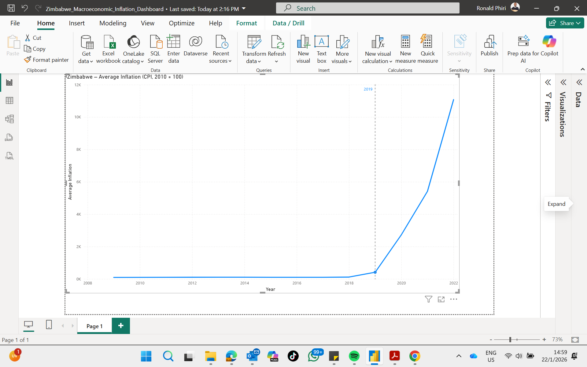

# Zimbabwe Macroeconomic Inflation Dashboard

## Overview
This project analyzes Zimbabwe’s inflation trends using Consumer Price Index (CPI) data from the World Bank, combined with population data to provide macroeconomic context.

The dashboard highlights the sharp inflation surge post-2019 and presents the data in a clean, year-based analytical model.

This project was built as part of a structured Power BI learning path focused on data modeling, DAX fundamentals, and analytical storytelling.

## Tools & Technologies
- Power BI
- Power Query (Web API & web data extraction)
- DAX
- World Bank Open Data
- Wikipedia Population Data

- ## Data Sources

- **World Bank Open Data**  
  Consumer Price Index (CPI) data for Zimbabwe  
  https://data.worldbank.org/indicator/FP.CPI.TOTL?locations=ZW

- **Wikipedia**  
  Zimbabwe population data (used for macroeconomic context)  
  https://en.wikipedia.org/wiki/Demographics_of_Zimbabwe

## Key Features
- Multi-source data ingestion (API and web)
- Data cleaning and transformation in Power Query
- Proper year-based dimensional modeling
- Interactive inflation trend visualization
- Contextual annotations explaining major inflation spikes

## Dashboard Preview

## Author
Ronald Phiri
